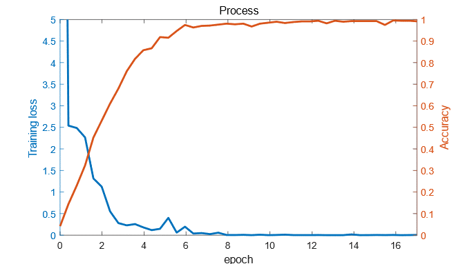

# 深度学习的专业术语

>作者：陈若愚

>QQ：2389388826

>日期：2020年2月26日

## Abstract

> 最近在整理学术论文的过程中发现自己的专业术语不完全正确，因此做如下的整理。主要是围绕着深度学习技术，通过做过的东西延申其基本公式及英文表达。文本采用Markdown方式编辑[1]。

[TOC]

## 一、人工神经网络

### 1.人工神经网络：Artificially neural network

通常指仅由全连接层构成的神经网络

### 2.全连接层：Fully connected layer

### 3.隐层：Hiden layer

### 4.神经元：neuron / 节点：node

指每一层全连接层所含的参数个数

### 5.多层感知机：Multilayer Perceptron (MLP)

## 二、2D卷积神经网络

### 1. 前向传播：		Forward Propagation

### 2. 卷积神经网络：	Convolutional neural network

### 3. 卷积：			Convolution

#### 卷积步长：stride

#### 填充：padding

填充是针对卷积后卷积层的receptive filed是否发生变化

### 4. 卷积运算：Convolution operation

### 5. 卷积核：Convolutional filter

### 6. 卷积层：Convolutional layer

### 7. 描述2D卷积卷积核大小：Kernel size / Receptive field

通常描述是卷积核的width和height的大小，比如3*3的卷积核，而与channel方向的卷积核长度无关，长度只与前一层卷积核个数有关。

### 8. 激活函数：Activation function
#### (1)Sigmoid:

$$Sigmoid(x)=\frac{1}{1+e^{-x}}$$

#### (2)Tanh:

$$
Tanh(x)=\frac{e^{2x}-1}{e^{2x}+1}
$$

#### (3)Relu:

$$
Relu(x)=\left\{\begin{matrix} x,x\geq 0\\0,x< 0 \end{matrix}\right.
$$

#### (4)Elu:

$$
Elu(x)=\left\{\begin{matrix}x\qquad \quad\,\,,x\geq 0 \\ a(e^{x}-1),x<0 \end{matrix}\right. \qquad a>0
$$

#### (5)Selu:

$$
Selu(x)=\lambda \left\{\begin{matrix}x \qquad\quad\,\,\,,x \geq 0 \\ \alpha (e^{x}-1),x<0 \end{matrix}\right. \\ \left\{\begin{matrix} \alpha =1.6732632423543772848170429916717 \\ \lambda=1.0507009873554804934193349852946 \end{matrix}\right.
$$

#### (6)Softplus:

$$
Softplus(x)=log(e^{x}+1)
$$

#### (7)Softmax:

$$
Softmax(x)_{i}=\frac{e^{x_{i}}}{\sum_{k=1}^{K}e^{x_{k}}}
$$

### 9. 最大池化：Max pooling

### 10. 平均池化：Mean pooling

### 11. BN: Batch Normalization

一种非常有效的正则化方法

### 12. Dropout

一种正则化方法

In order to avoid over fitting prob- lem in the designed networks, we adopted the “Dropout” method to drop out 25% hidden neurons after the third fully connected layers.

### 13.   / suqared loss

$$
S=\sum_{i=1}^{n}(Y_{i}-f(x_{i}))^{2}
$$

### 14. MSE: Mean square loss

$$
MSE=\frac{1}{n}\sum_{i=1}^{n}(Y_{i}-f(x_{i}))^{2}
$$

### 15.  正则化：  regularization

$$
J(\theta )=\frac{1}{2m}\left [ \sum_{i=1}^{m}(h_{\theta}(x_{i})-y_{i})^{2}+\lambda (\sum_{j=1}^{n}\theta ^{2}_{j}) \right ]
$$

### 16. 反向传播：backpropagation

### 17. 优化方法：Optimization
>注：编程中的函数习惯用Optimizer，在学术写作尽量用Optimization,例如Adam optimization method
#### (1)Gradient Descent
#### (2)SGD
#### (3)Momentum
#### (4)Adagrad
#### (5)Adadelta
#### (6)RMSprop
#### (7)Adam

### 18. 学习率：Learning rate

### 19. 指数衰减学习率：Learning rate exponential decay

$$
decayed\_learning\_rate=learning\_rate\cdot decay\_rate^{\frac{global\_step}{decay\_step}}
$$

### 20. 训练步数：Step

经过一次优化为一步

### 21. 训练周期：Epoch

将数据集全部输入一轮回为一个epoch

### 22. 收敛：Convergence

当在训练神经网络时，准确率或者损失函数随训练步数的增加而变化很小时即为收敛

### 23. 回归：Regression

### 24. 分类：Classification

### 25. 交叉熵损失函数：Cross-entropy

常用于多分类任务的代价函数

$$
L=-\sum_{i=1}^{N}y_{i}\cdot log(\hat{y}_{i})+(1-y_{i})\cdot log(1-\hat{y}_{i})
$$

### 26. 批量输入大小：Batch size

### 27. 学习曲线：Learning curve

### 28. 训练集，交叉验证集，测试集：Training set, cross-validation set, test set

### 29. 精度：Precise

多评价回归问题

### 30. 准确率：Accuracy

多评价分类问题

## Reference
[1] [https://www.zybuluo.com/mdeditor?url=https://www.zybuluo.com/static/editor/md-help.markdown](https://www.zybuluo.com/mdeditor?url=https://www.zybuluo.com/static/editor/md-help.markdown)

[2] [https://developers.google.com/machine-learning/glossary#c](https://developers.google.com/machine-learning/glossary#c)

[3] [https://acadgild.com/blog/data-science-glossary-deep-learning-key-terms](https://acadgild.com/blog/data-science-glossary-deep-learning-key-terms)

[4] [https://www.analyticsvidhya.com/blog/2017/05/25-must-know-terms-concepts-for-beginners-in-deep-learning/](https://www.analyticsvidhya.com/blog/2017/05/25-must-know-terms-concepts-for-beginners-in-deep-learning/)

[5] Luo G , Dong S , Wang K , et al. Multi-Views Fusion CNN for Left Ventricular Volumes Estimation on Cardiac MR Images[J]. Biomedical Engineering, IEEE Transactions on, 2018, 65(9):1924-1934.
